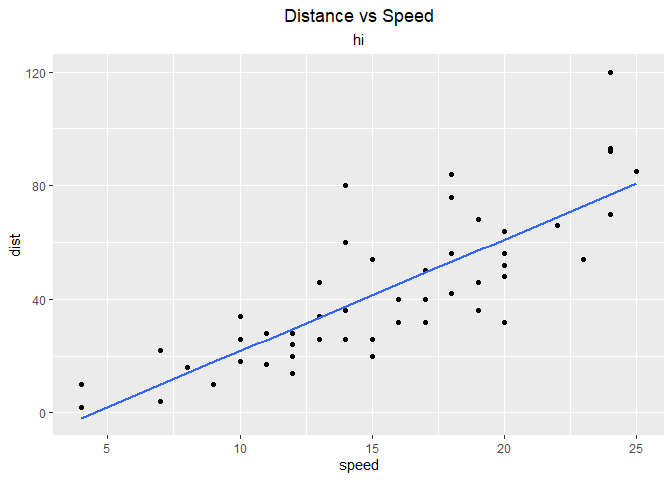
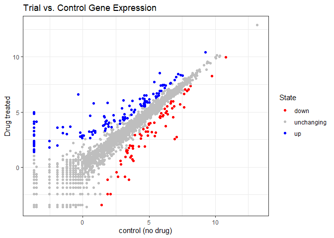
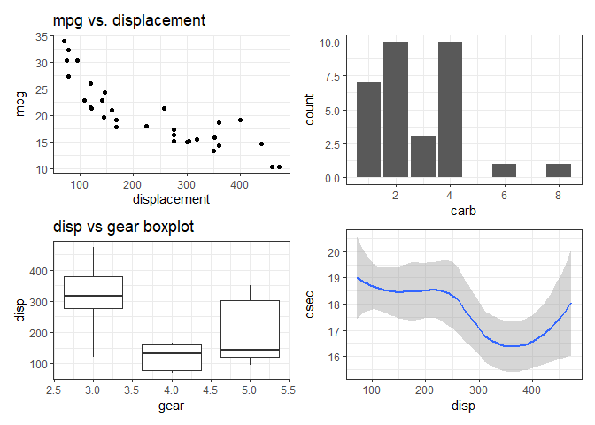
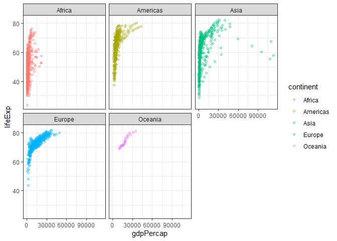

# Data Viz with ggplot
Jihyun In(PID: A16955363)

- [Background](#background)
- [Gene Expression Plot](#gene-expression-plot)
  - [Custom Color Plot](#custom-color-plot)
- [Using different geoms](#using-different-geoms)
- [Econcomic status](#econcomic-status)

# Background

There ar eamny graphics systems available in R. These include “base” R
and tons of add on packages like **ggplot2**

Let’s compare “base” and **ggplot 2** briefly. We can use some example
data that is built-in with R called `cars`:

``` r
head(cars)
```

      speed dist
    1     4    2
    2     4   10
    3     7    4
    4     7   22
    5     8   16
    6     9   10

In base R I can just call `plot()`

``` r
plot(cars)
```


How can we do this with **ggplot2**

First we need to install the package. We do this with
`install.packages("ggplot2")`. I only need to do this once and then it
will be available on my computer from then on.

> Key point: I only install packages in the R console, not within quarto
> docs or R scripts.

Before I use any add-on package I must load it up wit ha call to
`library()`

``` r
library(ggplot2)
ggplot(cars)
```


Every ggplot has at least 3 things.

- the **data** (in our case `cars`)
- the **aes**thetics (how the data maps to the plot)
- the **geom**s that determine how the plot is drawn(Lines, pots,
  columns, etc. )

``` r
ggplot(cars)  + 
  aes(x=speed, y=dist) + 
  geom_point()
```


For “simple” plots ggplot is much more verbose than base R but the
defaults are nicer and for complicated plots it becomes much more
efficient and structured.

> Q. dd a line to show the relationship of speed to dtopping distance
> (i.e. add another “layer”)

``` r
p <- ggplot(cars) + 
  aes(x = speed, y= dist) + 
  geom_point() + 
  geom_smooth(se=FALSE, method="lm")
```

I can always save any ggplot object (i.e. plot) and then use it later or
adding more layers.

``` r
p + 
  ggtitle(label="Distance vs Speed", subtitle="hi") + 
  theme(plot.title = element_text(hjust = 0.5), plot.subtitle = element_text(hjust = 0.5))
```

    `geom_smooth()` using formula = 'y ~ x'



> Q. Add a title and subtitle to the plot

# Gene Expression Plot

``` r
url <- "https://bioboot.github.io/bimm143_S20/class-material/up_down_expression.txt"
genes <- read.delim(url)
head(genes,20)
```

             Gene Condition1 Condition2      State
    1       A4GNT -3.6808610 -3.4401355 unchanging
    2        AAAS  4.5479580  4.3864126 unchanging
    3       AASDH  3.7190695  3.4787276 unchanging
    4        AATF  5.0784720  5.0151916 unchanging
    5        AATK  0.4711421  0.5598642 unchanging
    6  AB015752.4 -3.6808610 -3.5921390 unchanging
    7       ABCA7  3.4484220  3.8266509 unchanging
    8   ABCA9-AS1 -3.6808610 -3.5921390 unchanging
    9      ABCC11 -3.5288580 -1.8551732 unchanging
    10      ABCC3  0.9305738  3.2603040         up
    11      ABCC5  4.6004252  5.4994435         up
    12  ABCC5-AS1 -3.6808610 -3.4401355 unchanging
    13    ABCC6P1 -0.7215031 -0.2702107 unchanging
    14      ABCD1  2.6805956  3.3800430 unchanging
    15     ABHD11  4.4136560  3.9521816 unchanging
    16     ABI3BP -1.2069298 -3.5921390 unchanging
    17       ABL1  6.3583620  6.0814650 unchanging
    18     ABLIM2 -1.9438953 -1.1182077 unchanging
    19        ABO -3.6808610 -3.5921390 unchanging
    20       ABP1 -3.6808610 -3.5921390 unchanging

> Q. how many genes are in this wee dataset?

``` r
nrow(genes)
```

    [1] 5196

> Q. How many columns are there?

``` r
ncol(genes)
```

    [1] 4

> Q. What are the column names?

``` r
colnames(genes)
```

    [1] "Gene"       "Condition1" "Condition2" "State"     

> Q. How many “up” and “down” regulated genes are there?

``` r
# how I did it
# sum(genes$State == "up")
# sum(genes$State == "down")

# the better way
table(genes$State)
```


          down unchanging         up 
            72       4997        127 

## Custom Color Plot

> Q. Make a first plot of this data

``` r
ggplot(genes) + 
  aes(x=Condition1, y=Condition2, col=State) +
  scale_color_manual(values=c("red", "grey", "blue")) +
  geom_point() + 
  labs(title="Trial vs. Control Gene Expression", x="control (no drug)", y="Drug treated") +
  theme_bw()
```



# Using different geoms

Let’s plot some aspects of the in-built `mtcars` dataset.

``` r
head(mtcars)
```

                       mpg cyl disp  hp drat    wt  qsec vs am gear carb
    Mazda RX4         21.0   6  160 110 3.90 2.620 16.46  0  1    4    4
    Mazda RX4 Wag     21.0   6  160 110 3.90 2.875 17.02  0  1    4    4
    Datsun 710        22.8   4  108  93 3.85 2.320 18.61  1  1    4    1
    Hornet 4 Drive    21.4   6  258 110 3.08 3.215 19.44  1  0    3    1
    Hornet Sportabout 18.7   8  360 175 3.15 3.440 17.02  0  0    3    2
    Valiant           18.1   6  225 105 2.76 3.460 20.22  1  0    3    1

> Q. scatter plot of `mpg` vs `displacement`

``` r
p1 <- ggplot(mtcars) + 
  aes(x=disp, y=mpg) + 
  geom_point() +
  theme_bw() + 
  labs(title = "mpg vs. displacement", x="displacement")
```

> Q. boxplot of `gear` vs `displacement`

``` r
  p2 <- ggplot(mtcars) + 
  aes(gear, disp, group=gear)+ 
  geom_boxplot() + 
  theme_bw() + labs(title="disp vs gear boxplot")
```

> Q. barplot of `carb`

``` r
p3 <- ggplot(mtcars) + 
  aes(carb) + 
  geom_bar() + 
  theme_bw()
```

> Q. Smooth of `qsec` vs. `disp`

``` r
p4 <- ggplot(mtcars) + 
  aes(x=disp, y=qsec) + 
  geom_smooth() + 
  theme_bw()
```

I want to combine all these plots into one figure with multiple panels.
We can use **patchwork** package to do this.

``` r
library(patchwork)

(p1 / p2 | p3 / p4)
```

    `geom_smooth()` using method = 'loess' and formula = 'y ~ x'



``` r
ggsave(filename="my_figure.png",width=8, height=5)
```

    `geom_smooth()` using method = 'loess' and formula = 'y ~ x'

# Econcomic status

``` r
# File location online
url <- "https://raw.githubusercontent.com/jennybc/gapminder/master/inst/extdata/gapminder.tsv"

gapminder <- read.delim(url)
```

And a wee peek

``` r
head(gapminder)
```

          country continent year lifeExp      pop gdpPercap
    1 Afghanistan      Asia 1952  28.801  8425333  779.4453
    2 Afghanistan      Asia 1957  30.332  9240934  820.8530
    3 Afghanistan      Asia 1962  31.997 10267083  853.1007
    4 Afghanistan      Asia 1967  34.020 11537966  836.1971
    5 Afghanistan      Asia 1972  36.088 13079460  739.9811
    6 Afghanistan      Asia 1977  38.438 14880372  786.1134

> Q. How many countries are in this dataset?

``` r
length(table(gapminder$country))
```

    [1] 142

> Q. Plot gdpPercap vs lifeExp colored by continent

``` r
ggplot(gapminder) + 
  aes(x = gdpPercap, y=lifeExp, col=continent) + 
  geom_point(alpha = 0.3) + 
  facet_wrap(~continent) + 
  theme_bw()
```


